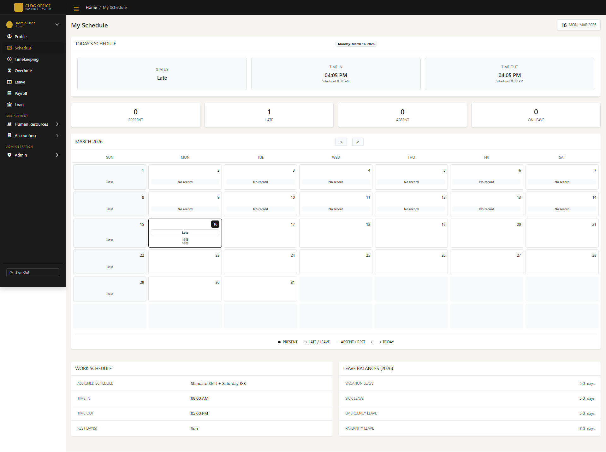
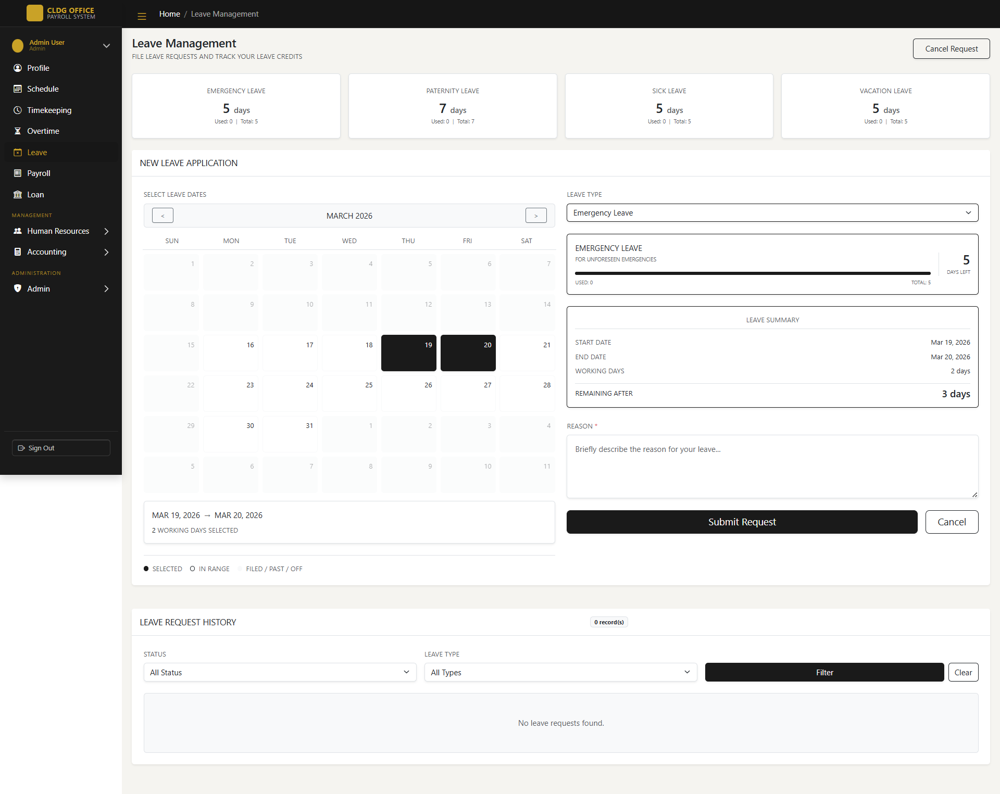
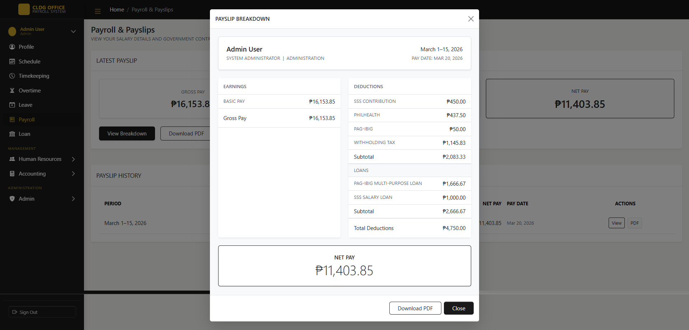
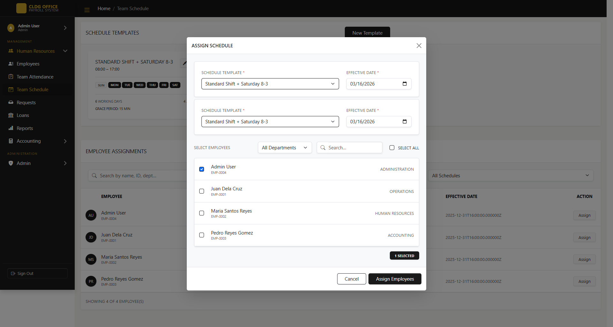
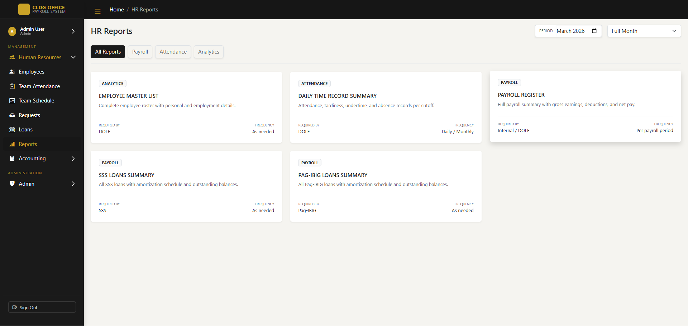
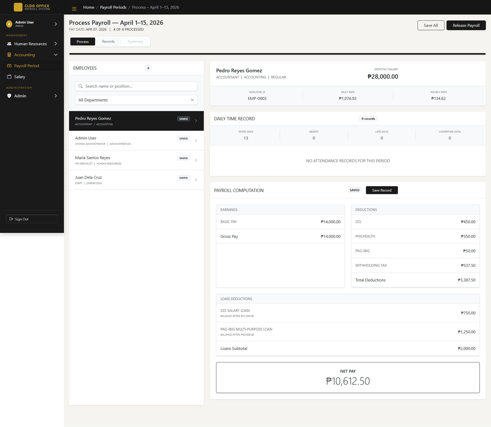
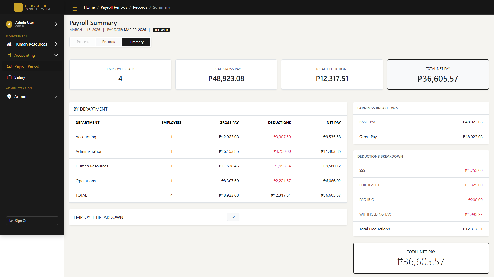
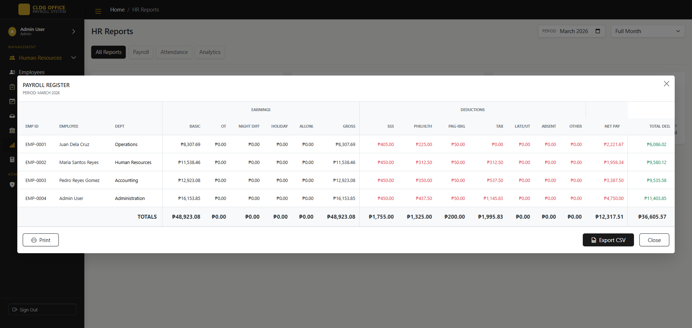
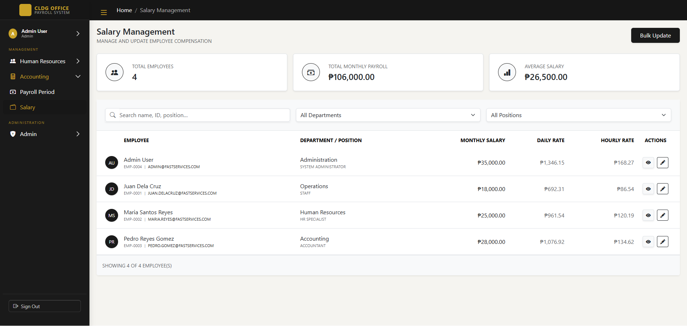
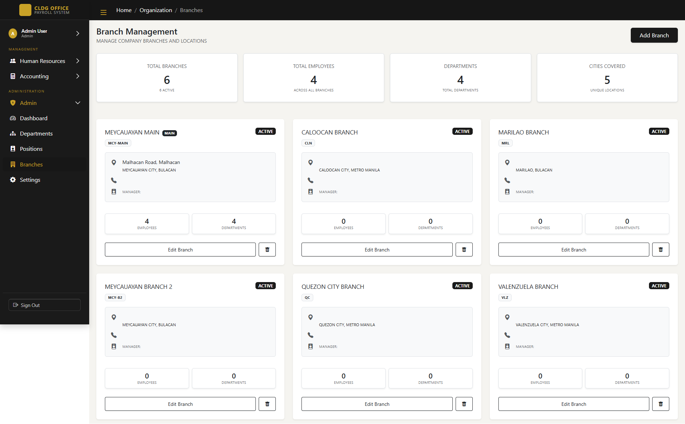

# CLDG Office Payroll System
A web-based payroll and HR management system built with Laravel and Bootstrap 5.
Supports multiple roles — Employee, HR, Accounting, and Admin — each with their own set of modules and access.


---

## Table of Contents
- [About](#about)
- [Screenshots](#screenshots)
- [Modules](#modules)
- [Integrations](#integrations)
- [Tech Stack](#tech-stack)
- [Setup](#setup)
- [Roles](#roles)

---

## About
This system was built to handle the day-to-day payroll and HR operations of a multi-branch office. It covers everything from clocking in and filing leaves to processing payroll periods and generating reports — all in one place with role-based access.

---

## Screenshots
> Screenshots are stored in the `/screenshots` folder.

### General
| Page | Preview |
|------|---------|
| Login |  |

---

### Employee
| Page | Preview |
|------|---------|
| Schedule |  |
| Timekeeping |  |
| Leave Request |  |
| Payslip |  |

---

### Human Resources
| Page | Preview |
|------|---------|
| HR Schedule |  |
| HR Reports |  |

---

### Accounting
| Page | Preview |
|------|---------|
| Payroll Process |  |
| Payroll Summary |  |
| Payroll Report |  |
| Salary |  |

---

### Admin
| Page | Preview |
|------|---------|
| Departments |  |
| Branches |  |

---

## Modules

**Employee**
- Schedule, Timekeeping, Leave Request, Payslip

**Human Resources**
- Employee Management, Attendance, Schedules, Request Approvals, Loan Management, Reports

**Accounting**
- Payroll Process, Payroll Summary, Payroll Report, Salary

**Admin**
- Departments, Branches, System Settings

---

## Integrations

### Government Loan Portal API
> Companion app: [Laravel-Loan-Api](https://github.com/Zmetrical/Laravel-Loan-Api)

This system integrates with a separate **Government Loan Simulation API** that mimics the SSS and PAG-IBIG member portals. The API acts as an external loan application platform — employees submit loan requests there, and once approved, HR encodes the approved applications directly into the payroll system.

**Configuration** — set the portal base URL in `.env`:
```env
GOVERNMENT_API_URL=http://your-loan-api-url
GOVERNMENT_API_TOKEN=your-api-token
```

> The portal integration is optional. Loans can still be added manually through the Loan Management module without connecting to the portal API.

---

## Tech Stack
- **Backend** — Laravel (PHP)
- **Frontend** — AdminLTE, Bootstrap 5, Bootstrap Icons
- **Database** — MySQL
- **Auth** — Laravel Auth with role-based access control
- **External API** — Government Loan Portal ([Laravel-Loan-Api](https://github.com/Zmetrical/Laravel-Loan-Api))

---

## Setup
```bash
git clone https://github.com/your-username/cldg-payroll-system.git
cd cldg-payroll-system
composer install
npm install && npm run dev
cp .env.example .env
php artisan key:generate
```

Update your `.env` with your database credentials and (optionally) the loan portal API URL:
```env
DB_DATABASE=cldg_pms
DB_USERNAME=root
DB_PASSWORD=

GOVERNMENT_API_URL=http://localhost:8001
GOVERNMENT_API_TOKEN=your-api-token
```

Then:
```bash
php artisan migrate --seed
php artisan storage:link
php artisan serve
```

> To use the Government Loan Portal integration, clone and run [Laravel-Loan-Api](https://github.com/Zmetrical/Laravel-Loan-Api) separately and point `GOVERNMENT_API_URL` to it.

---

## Roles
| Role | What they can access |
|------|----------------------|
| `employee` | Their own profile, schedule, timekeeping, leaves, overtime, payroll, loans |
| `hr` | All employee records, attendance, schedules, request approvals, loans, reports |
| `accounting` | Payroll periods and salary processing |
| `admin` | Everything above + departments, positions, branches, and system settings |

---

> Built with Laravel & AdminLTE Bootstrap
