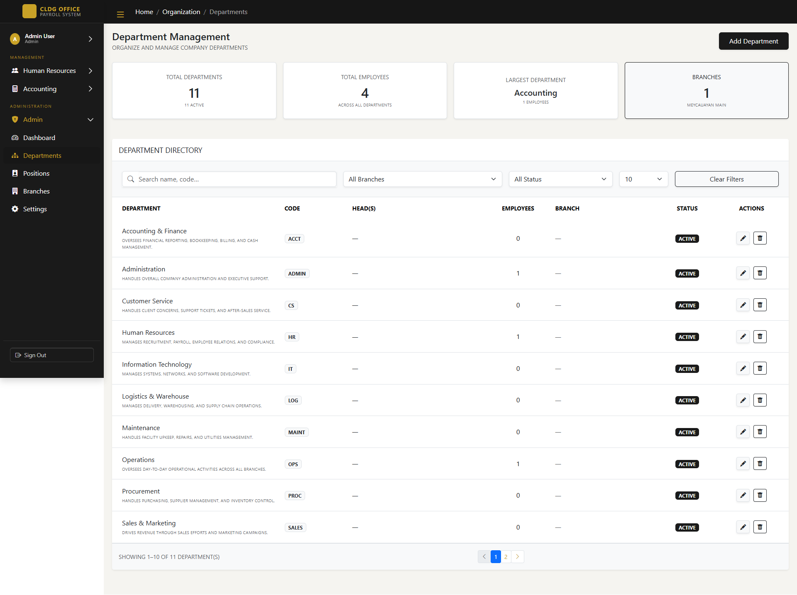

# CLDG Office Payroll System

A web-based payroll and HR management system built with Laravel and Bootstrap 5.
Supports multiple roles — Employee, HR, Accounting, and Admin — each with their own set of modules and access.


---

## Table of Contents

- [About](#about)
- [Screenshots](#screenshots)
- [Modules](#modules)
- [Tech Stack](#tech-stack)
- [Setup](#setup)
- [Roles](#roles)

---

## About

This system was built to handle the day-to-day payroll and HR operations of a multi-branch office. It covers everything from clocking in and filing leaves to processing payroll periods and generating reports — all in one place with role-based access.

---

## Screenshots

| Page | Preview |
|------|---------|
| Login |  |
| Dashboard |  |
| Employee Portal |  |
| Timekeeping |  |
| Payroll Period |  |
| Team Attendance |  |
| Requests |  |
| Departments |  |

---

## Modules

**Employee**
- Profile, Schedule, Timekeeping, Overtime, Leave, Payroll, Loans

**Human Resources**
- Employee Management, Team Attendance, Team Schedule, Request Approvals, Loans, Reports

**Accounting**
- Payroll Periods, Salary Processing

**Admin**
- Dashboard, Departments, Positions, Branches, Settings

---

## Tech Stack

- **Backend** — Laravel (PHP)
- **Frontend** — Bootstrap 5, Bootstrap Icons
- **Database** — MySQL
- **Auth** — Laravel Auth with role-based access control

---

## Setup

```bash
git clone https://github.com/your-username/cldg-payroll-system.git
cd cldg-payroll-system

composer install
npm install && npm run dev

cp .env.example .env
php artisan key:generate
```

Update your `.env` with your database credentials, then:

```bash
php artisan migrate --seed
php artisan storage:link
php artisan serve
```

---

## Roles

| Role | What they can access |
|------|----------------------|
| `employee` | Their own profile, schedule, timekeeping, leaves, overtime, payroll, loans |
| `hr` | All employee records, attendance, schedules, request approvals, loans, reports |
| `accounting` | Payroll periods and salary processing |
| `admin` | Everything above + departments, positions, branches, and system settings |

---

> Built with Laravel & Bootstrap 5
